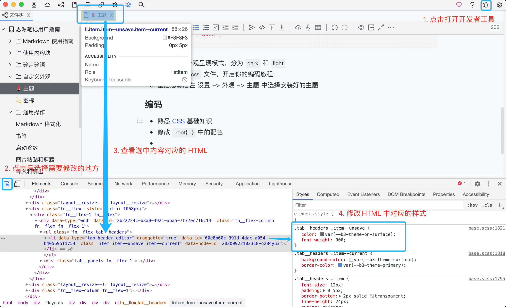

## Installation
{: id="20201225174048-t626xpi" updated="20210302223520"}

### Manual
{: id="20201225221416-aotw0re"}

1. {: id="20201225221416-n3vvygb"}Get the theme from somewhere and unzip it
   {: id="20210131162108-02326cx"}
2. {: id="20201225221416-o84sp4q"}<kbd>Settings</kbd> - <kbd>Appearance</kbd> - <kbd>Theme</kbd> - <kbd>Open the theme folder</kbd>
   {: id="20210131162108-k4h81si" updated="20210512161438"}
3. {: id="20201225221416-oefusle"}Copy the theme to this folder
   {: id="20210131162108-v756fef"}
4. {: id="20201225221416-i8ic233"}Restart, select the desired theme in <kbd>Settings</kbd> - <kbd>Appearance</kbd> - <kbd>Theme</kbd>
   {: id="20210131162108-133g70d" updated="20210512161506"}
{: id="20201225221416-5jel77s"}

### Community Bazaar
{: id="20201225221416-enetgqg"}

* {: id="20201225221416-fwq6l32"}In <kbd>Settings</kbd> - <kbd>Appearance</kbd> - <kbd>Theme</kbd> - <kbd>Bazaar</kbd>, browse online themes contributed by community developers
  {: id="20210131162108-dtskbvb" updated="20210512161531"}
* {: id="20201225221416-6qqqwni"}Choose the required theme to install or update online
  {: id="20210131162108-2wwmc9r"}
{: id="20201225221416-chyd31p"}

## Development
{: id="20201225174048-i781zxp"}

### Step
{: id="20201225174048-3qumvw6"}

1. {: id="20201225174048-axf0aph"}Give your subject a nice name, such as `alice`
   {: id="20201225174048-dw4dke4"}
2. {: id="20201225174048-zfkshfl"}<kbd>Settings</kbd> - <kbd>Appearance</kbd> - <kbd>Theme</kbd> - <kbd>Open theme folder</kbd>
   {: id="20201225174048-1dt9umq" updated="20210512161558"}
3. {: id="20201225174048-92haint"}Create a new folder `alice` in the opened folder, and create new `theme.css` and `theme.json` files in `alice`
   The `theme.json` file is as follows:
   {: id="20201225174048-fh16r64"}

   ```json
   {
     "name": "midnight",
     "author": "Vanessa",
     "version": "1.0.0",
     "modes": ["dark"]
   }
   ```
   {: id="20201225174048-d4ms7ra"}

   `modes` is the appearance mode, divided into `dark` and `light`. Please modify the other fields as needed.
   {: id="20201225174048-crkpdob"}
4. {: id="20201225174048-e4e9234"}Open the `theme.css` file to start your coding journey
   {: id="20201225174048-2937fh2"}
5. {: id="20201225174048-sw6gvxg"}Restart, select the installed theme in <kbd>Settings</kbd> - <kbd>Appearance</kbd> - <kbd>Theme</kbd>
   {: id="20201225174048-xii3128" updated="20210512161645"}
{: id="20201225174048-zqtzaox"}

### Encoding
{: id="20201225174048-5e5cg0p"}

* {: id="20201225174048-tt2mbf7"}Familiar with [CSS](https://developer.mozilla.org/en-US/docs/Web/CSS) basic knowledge
  {: id="20210131162108-saji8q4"}
* {: id="20201225174048-1ocyqbk"}Modify the color scheme in `:root{...}`. ⚠️ The variable items inherent in the official cannot be deleted
  {: id="20210131162108-nh3eyq7" updated="20210318104316"}
* {: id="20201225174048-c3hch71"}Continue to modify according to steps 1-4 in the figure
  
  {: id="20210131162108-0cl55js" updated="20210512172253"}
* {: id="20201225174048-9mhz3ye"}Copy and paste the modified content into `theme.css` and save
  {: id="20210131162108-pz4fy37"}
* {: id="20201225174048-k5l65hd"}Check the `Disable cache` in `Network` and run `window.location.reload()` to see the final result
  
  {: id="20210131162108-ibds25b" updated="20210512172321"}
{: id="20201225174048-g8oxi84" updated="20210318104313"}

### Push to theme bazaar
{: id="20201225222754-u4sica8"}

Please make sure that the root path of your theme repository contains at least these three files before listing ([repo example](https://github.com/88250/Comfortably-Numb)):
{: id="20201225231001-q8d13v2"}

* {: id="20201225231001-kb3qapf"}theme.css
  {: id="20210131162108-mifil8g"}
* {: id="20201226180450-4y3o8g8"}theme.json (please make sure the JSON format is correct)
  {: id="20210131162108-6ie2luy"}
* {: id="20201226180450-6w0hjs4"}preview.png (please compress the image size within 128 KB)
  {: id="20210131162108-v7g3c2i"}
{: id="20201226180450-l11kqks"}

After confirmation, please [create a pull request](https://docs.github.com/en/free-pro-team@latest/github/collaborating-with-issues-and-pull-requests/creating-a-pull-request) to the [Community Bazaar](https://github.com/siyuan-note/bazaar) repository and modify the themes.json file in it. This file is the index of all community theme repositories, the format is:
{: id="20201225222754-swy5dnu"}

```json
{
   "repos": [
     "username/reponame@commithash"
   ]
}
```
{: id="20201225222754-zffy1v0"}

Among them, `commithash`, please fill in the Git commit hash of the latest released version on your theme repository, please use the full hash value instead of the 7-digit short value.
{: id="20201225225305-ow7lt63"}

#### Update
{: id="20201225222754-vp8gpwl"}

If the theme you developed has an updated version, please remember:
{: id="20201225222754-wl778nt"}

* {: id="20201225222754-ktaqtbm"}Update the version field in your theme.json
  {: id="20210131162108-z878ztw"}
* {: id="20201225222754-llxlasf"}Create a Pull Request to the community bazaar
  {: id="20210131162108-cu0iz8e"}
{: id="20201225222754-o3nz94w"}


{: id="20200924095938-a9p5450" type="doc"}
