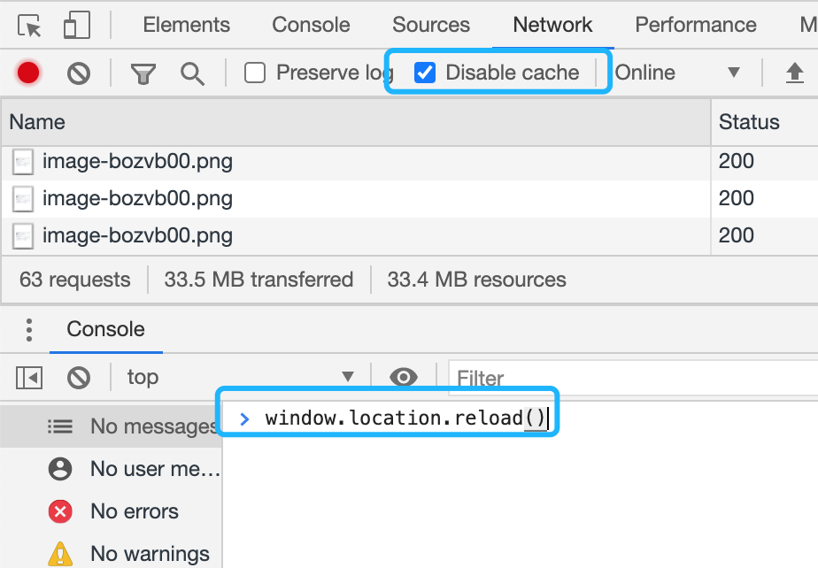

## Installation

1. Get the theme and unzip
2. In Siyuan, click Settings -> Appearance -> Theme -> Open theme folder
3. Copy the theme to this directory
4. After restarting Siyuan, select the installed theme in Settings -> Appearance -> Theme

## Development

### Step

1. Give your subject a nice name, such as `alice`
2. In Siyuan, click Settings -> Appearance -> Theme -> Open theme folder
3. Create a new folder `alice` in the opened folder, and create new `theme.css` and `theme.json` files in `alice`
   The `theme.json` file is as follows:

   ```json
   {
     "author": "Vanessa",
     "version": "1.0.0",
     "modes": ["dark"]
   }
   ```

   `modes` is the appearance mode, divided into `dark` and `light`
4. Open the `theme.css` file to start your coding journey
5. After restarting Siyuan, select the installed theme in Settings -> Appearance -> Theme

### Encoding

* Familiar with [CSS](https://developer.mozilla.org/zh-CN/docs/Web/CSS) basic knowledge
* Modify the color scheme in `:root{...}`
* Continue to modify according to steps 1-4 in the figure
  
* Copy and paste the modified content into `theme.css` and save
* Check the `Disable cache` in `Network` and run `window.location.reload()` to see the final result
  
* Released on the shelf (contact QQ: 84588990)
